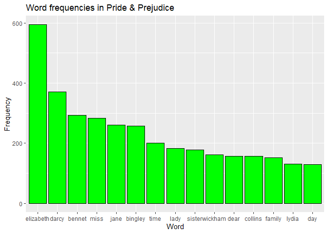
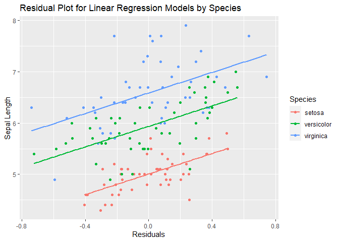

Strings and functional programming in R
================
Gopal Khanal

## Exercise 1

Take a Jane Austen book contained in the janeaustenr package, make a
plot of the most common words in the book, removing stopwords from a
pre-defined source, tidytext::stop_words.

If you use any resources for helping you remove stopwords, or some other
resource besides the janeaustenr R package for accessing your book,
please indicate the source. We aren’t requiring any formal citation
styles, just make sure you name the source and link to it.

**In this exercise**, I used the book Pride & Prejudice from Jane
Austen’s Complete Novels R package `janeaustenr`. I first extracted text
and split into words, removed non-alphabetic characters and empty
strings, and removed stop words, and then created a barplot of 15 most
frequently used words. The word **elizabeth** is the most frequently
used word in this book.

``` r
# Extract text from "Prideprejudice" and split into words
book_pride <- unlist(str_split(janeaustenr::prideprejudice, pattern = " "))

# Convert to lowercase and remove non-alphabetic characters
book_pride <- tolower(book_pride) %>% str_replace_all("[^a-zA-Z]", "")

# Remove empty strings
book_pride <- book_pride[nzchar(book_pride)]

# Remove stop words
pride_nostop <- book_pride[!(book_pride %in% tidytext::stop_words$word)]

# Create a bar plot of word frequencies
ggplot(data.frame(head(sort(table(pride_nostop), decreasing = TRUE), n = 15))) + 
  geom_bar(aes(x = pride_nostop, y = Freq), stat = "identity", fill = "green", color = "black") +
  labs(title = "Word frequencies in Pride & Prejudice", x = "Word", y = "Frequency")
```

<!-- -->

## Exercise 2

**Instruction**: Make a function that converts words to your own version
of Pig Latin. Johnson Chen version: Piglet Latin. Move first half of the
word (first half round up) to the end of word, and add “comrade” to the
end of word if the word is not in `tidytext::stop_words` The specific
input and output that you decide upon is up to you. Don’t forget to
implement good function-making hygiene: we’ll be looking for
(unrendered) roxygen2-style documentation (being sure to describe your
Pig Latin conversion), examples of applying the function, 3
non-redundant tests, appropriate use of arguments, and appropriate
amount of checking for proper input.

**My custom version**

I built a function that takes character string (a single word) as an
input, and if the first letter of the word is `vowel`, it rearranges the
word by moving the last letter to the start and then adds “omg” at the
end, otherwise (if first letter is `consonant`), it rearranges the word
by moving the first letter to the end, then the last letter to the
start, and adds “omg” at the end as suffix.

``` r
#' @Title Convert words to custom Pig Latin
#'
#'@description  This function takes a word as input and converts it to a custom version of Pig Latin.
#'My version of Pig Latin incorporates a rearrangement component and an addition  #'component.
#' The rearrangement component involves moving the last letter to the beginning,
#' while the addition component appends "_omg" to the end of the rearranged word.
#'
#' @param word Character string, the word to be converted to Pig Latin.
#'
#' @return Character string, the custom Pig Latin version of the input word.
#'
#' @examples
#' pig_latin("hello") # Returns "oellhomg"
#' pig_latin("apple") # Returns "eapplomg"
#'
#' @export
#' 
pig_latin <- function(word) {
  # Input validation, checks whether the input (word) is a character string and has a length of exactly 1.
  # If the condition is not met (i.e., if the input is not a single word), it throws an error
  # using the stop function, indicating that the input must be a single word (character string).
  if (!is.character(word) || length(word) != 1) {
    stop("Input must be a single word (character string).")
  }
  
  if (nchar(word) == 0) {
    return("omg")
  }
  # Checking if word starts with a vowel
  # Also converts word to lowercase for case-insensitivity
  if (tolower(substr(word, 1, 1)) %in% c('a', 'e', 'i', 'o', 'u')) {
    # Pig Latin Transformation for Vowels
    # Moving the last letter to the start and add "omg"
    # If the word starts with a vowel, it rearranges the word by moving the last letter to the start 
    #and then adds "omg" at the end. It uses the substr function to extract substrings of the word.
    return(paste0(substr(word, nchar(word), nchar(word)), substr(word, 1, nchar(word) - 1), "omg"))
  } else {
    # Pig Latin Transformation for Consonants:
    # Moving the first letter to the end, then the last to the start, and add "omg"
    # If the word starts with a consonant letter, the code rearranges the word by moving the first #letter to the end, then the last letter to the start, and adds "omg" at the end.
    return(paste0(substr(word, nchar(word), nchar(word)), substr(word, 2, nchar(word) - 1), 
                  substr(word, 1, 1), "omg"))
  }
}
```

### Examples

This example inputs the word “apple”, which starts with vowel letter
‘a’. Thus, the last letter ‘e’ comes to first and suffix ‘omg’ is added
at the end of the word. Hence the output is ’eapplomg

``` r
pig_latin("apple")
```

    ## [1] "eapplomg"

This example inputs the word “mango”, which starts with consonant letter
‘c’. Thus, the last letter ‘e’ comes to first, then first letter c goes
to end, and adds the suffix ‘omg’ at the end of the word. Hence the
output is ‘sampucomg’.

``` r
pig_latin("campus")
```

    ## [1] "sampucomg"

### Tests

#### Basic test cases

``` r
test_that ("The custom Pig Latin conversion works correctly", { expect_equal(pig_latin("adult"), "tadulomg")
expect_equal(pig_latin("cat"), "tacomg")
expect_equal(pig_latin("dog"), "godomg")
})
```

    ## Test passed 🎊

#### Non standard input cases

``` r
test_that("Gives error with Non-Standard Input", {
  expect_error(pig_latin(000))
  expect_error(pig_latin(TRUE))
  expect_error(pig_latin(NULL))
})
```

    ## Test passed 😸

#### Handles empty and single character strings

``` r
test_that("Handles Empty and Single Character Strings", {
  expect_equal(pig_latin(""), "omg")
  expect_equal(pig_latin("a"), "aomg")
})
```

    ## Test passed 🎉

### Exercise 3

Demonstrating the functionality of important functions in R package
`purrr`. Evaluating linear regression models for each species predict
their sepal length based on variables such as sepal width, petal length,
and petal width using iris data set.

**Demonstration**  
In this analysis, I fit separate linear models for sepal length as a
function of petal length, petal width, and sepal width for each species
in the `iris` dataset. The functions `map` and `nest` and their
extensions in `purrr` provides intuitive way to store models for each
species as list. I then evaluated the model residuals, and the
intermediate tibble contains the model summaries.The `unnest` function
allowed to create a new dataframe with three columns-Species,
Sepal.Length, and residuals columns. I produced a scatter plot with a
linear regression line to visualize the residuals obtained from linear
regression models for each three species.

``` r
# Load necessary packages
library(tidyverse)
library(purrr)

# Load the mtcars dataset
data(iris)

# Step 1: Make a column of model objects
# Fit linear regression models for each species

models <- iris %>%
  group_by(Species) %>%
  
# The nest function is used to group the selected columns into a nested dataframe. 
# The data argument specifies which columns are to be nested. 
# In this case, it's nesting variables (Sepal.Length, Sepal.Width,Petal.Length, Petal.Width) 
# into a column named `data`. The result is a #dataframe where each row contains a species
# and a nested dataframe all other variables in irsh data
  nest(data = c(Sepal.Length, Sepal.Width,Petal.Length, Petal.Width)) %>%
  #nest() %>%
  
#The mutate function is creating a new column named model. The `map` function is used to apply the lm #(linear regression) function to each nested dataframe in the data column. The formula  ~ lm specifies #the linear regression model, where sepal length is regressed on the other variables. The data = .x #argument specifies that the model should be fitted using the data in the current nested dataframe.
  mutate(model = map(data, ~ lm(Sepal.Length~ Sepal.Width+Petal.Length+ Petal.Width, data = .)))

# Step 2: Evaluate the models
# Calculate the residuals for each model

# The mutate function is being used to add a new column named residuals to the models dataframe.
# The map2 function is used to apply the residuals function to each pair of elements from the model 
# and data columns. 
# model:  This column contains linear regression models.
# data: This column contains the data used to fit the respective linear regression models.
# The ~ residuals(.x, data = .y) part is a formula specifying that for each pair of model and data,
# the residuals of the linear regression model should be calculated. 
# The residuals function calculates the residuals (the differences between the observed and predicted #values) of the linear regression model.
#The result is a new column residuals in the models dataframe, where each element corresponds to the #residuals of the linear regression model fitted to the corresponding data.

models <- models %>%
  mutate(residuals = map2(model, data, ~ residuals(.x, data = .y)))

# Step 3: Print out the intermediate tibble for inspection

print(models)
```

    ## # A tibble: 3 × 4
    ## # Groups:   Species [3]
    ##   Species    data              model  residuals 
    ##   <fct>      <list>            <list> <list>    
    ## 1 setosa     <tibble [50 × 4]> <lm>   <dbl [50]>
    ## 2 versicolor <tibble [50 × 4]> <lm>   <dbl [50]>
    ## 3 virginica  <tibble [50 × 4]> <lm>   <dbl [50]>

``` r
# Step 4: Unnest the resulting calculation
# The code is taking the results dataframe, unnesting the data and residuals columns, and then selecting #only the Species, Sepal.Length, and residuals columns to create a new dataframe. The resulting #dataframe contains information about the species, original Sepal.Length values, and the residuals from #the linear regression models.
results <- models %>%
  unnest(cols = c(data, residuals)) %>%
  select(Species, Sepal.Length, residuals)

# Step 5: Print the final tibble to screen

print(results)
```

    ## # A tibble: 150 × 3
    ## # Groups:   Species [3]
    ##    Species Sepal.Length residuals
    ##    <fct>          <dbl>     <dbl>
    ##  1 setosa           5.1    0.0732
    ##  2 setosa           4.9    0.201 
    ##  3 setosa           4.7   -0.107 
    ##  4 setosa           4.6   -0.189 
    ##  5 setosa           5     -0.0923
    ##  6 setosa           5.4   -0.0104
    ##  7 setosa           4.6   -0.387 
    ##  8 setosa           5      0.0149
    ##  9 setosa           4.4   -0.234 
    ## 10 setosa           4.9    0.137 
    ## # ℹ 140 more rows

``` r
# Step 6: Produce a plot communicating something about the result
# The code generates a scatter plot with a linear regression line for the residuals obtained from linear #regression models. The points are colored based on the species, and the plot is annotated with a title #and axis labels
results %>%
  ggplot(aes(x = residuals, y = Sepal.Length, color = as.factor(Species))) +
  geom_point() +
  geom_smooth(method = "lm", se = FALSE) +
  labs(title = "Residual Plot for Linear Regression Models by Species",
       x = "Residuals",
       y = "Sepal Length",
       color = "Species")
```

    ## `geom_smooth()` using formula = 'y ~ x'

<!-- -->
